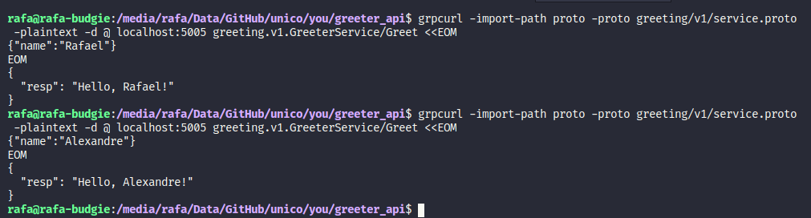

# greeter-api
To test the project, run

```go run cmd/main.go```

```
grpcurl -import-path proto -proto greeting/v1/service.proto -plaintext -d @ localhost:5005 greeting.v1.GreeterService/Greet <<EOM
{"name":"Rafael"}
EOM
```


